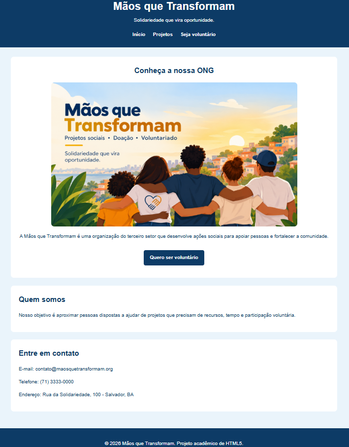

# Mãos que Transformam

> Projeto acadêmico de desenvolvimento web para uma ONG fictícia, desenvolvido com HTML5, CSS3 e JavaScript.

## 📌 Sobre o projeto

A Mãos que Transformam é uma organização do terceiro setor criada para fins acadêmicos. O site apresenta seus projetos sociais e disponibiliza um formulário para pessoas interessadas em atuar como voluntárias.

## 🛠️ Tecnologias

- HTML5
- CSS3
- JavaScript

## ✨ Funcionalidades

- Navegação entre páginas
- Apresentação dos projetos sociais
- Formulário para cadastro de voluntários
- Validação e interação utilizando JavaScript
- Layout responsivo